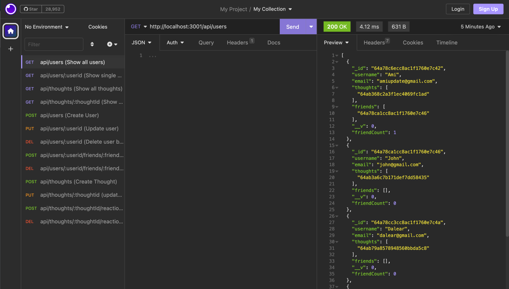

# Social Network API

This is a backend API for a social network application. It provides routes and controllers to handle user and thought data, as well as reactions and friend relationships.

## Table of Contents

- [Installation](#installation)
- [Usage](#usage)
- [API Routes](#api-routes)
- [Technologies Used](#technologies-used)
- [Demo](#demo)

## Installation

To use this API, follow these steps:

1. Clone the repository: `git clone https://github.com/Hiroro1989/social-network-api.git`
2. Navigate to the project directory: `cd social-network-api`
3. Install the dependencies: `npm install`
4. Run the application: `node index`

## Usage

After installing and running the API, you can use a tool like [Insomnia](https://insomnia.rest/) to interact with the API endpoints. The base URL for the API is `http://localhost:3001/api/`.

Refer to the [API Routes](#api-routes) section for available routes and their functionalities.

## API Routes

- **GET `/api/users`**: Get all users.
- **GET `/api/users/:userId`**: Get a single user by ID.
- **POST `/api/users`**: Create a new user.
- **PUT `/api/users/:userId`**: Update a user by ID.
- **DELETE `/api/users/:userId`**: Delete a user by ID.

- **GET `/api/thoughts`**: Get all thoughts.
- **GET `/api/thoughts/:thoughtId`**: Get a single thought by ID.
- **POST `/api/thoughts`**: Create a new thought.
- **PUT `/api/thoughts/:thoughtId`**: Update a thought by ID.
- **DELETE `/api/thoughts/:thoughtId`**: Delete a thought by ID.

- **POST `/api/thoughts/:thoughtId/reactions`**: Add a reaction to a thought.
- **DELETE `/api/thoughts/:thoughtId/reactions/:reactionId`**: Remove a reaction from a thought.

- **POST `/api/users/:userId/friends/:friendId`**: Add a friend to a user's friend list.
- **DELETE `/api/users/:userId/friends/:friendId`**: Remove a friend from a user's friend list.

## Technologies Used

- Node.js
- Express.js
- MongoDB
- Mongoose

## Demo

[Demo Video](https://drive.google.com/file/d/1xEmkLKv9rTLR32RqzeMMF-wDpxiWJVDM/view)

